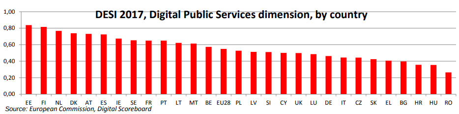
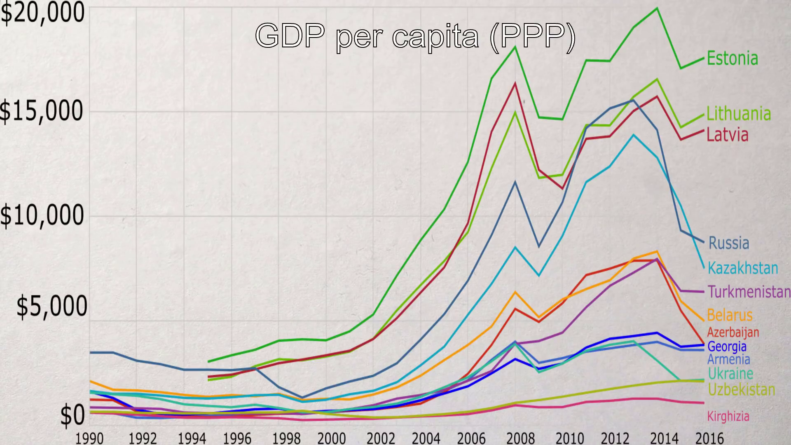
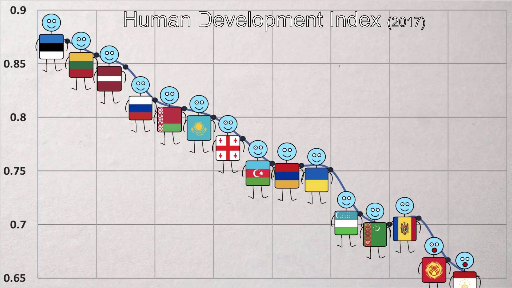
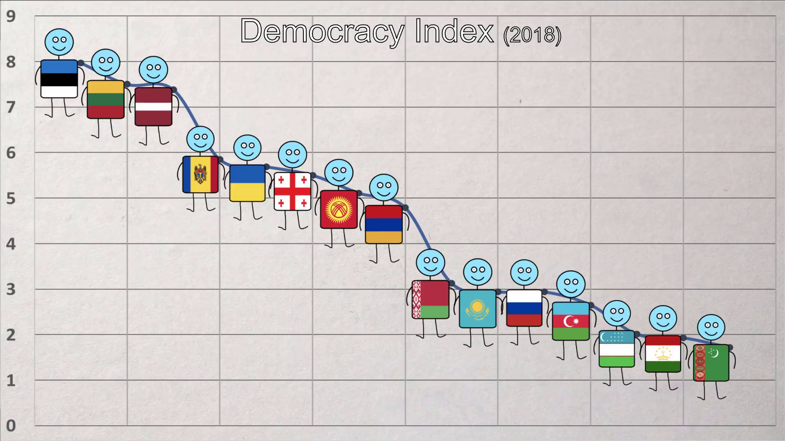

# Estonia

Estonia, is a country in Northern Europe. It is a developed country with an advanced, high-income economy that has been among the fastest-growing in the EU. Estonian citizens are provided with universal health care and free education. One of the world's most digitally advanced societies, in 2005 Estonia became the first state to hold elections over the Internet, and in 2014 the first state to provide e-residency.  
Estonia's economy continues to benefit from a transparent government and policies that sustain a high level of economic freedom, ranking 6th globally and 2nd in Europe. Estonia has the third lowest business bribery risk in the world. [[wiki]](https://en.wikipedia.org/wiki/Estonia)  

Its capital and largest city, Tallinn, is often dubbed the Silicon Valley of Europe. Tallinn has the highest number of startups per person in Europe. [[wiki]](https://en.wikipedia.org/wiki/Tallinn)

 

#### PISA

The Programme for International Student Assessment (PISA) is a worldwide study, intended to evaluate educational systems by measuring 15-year-old school pupils' scholastic performance on mathematics, science, and reading.  [[wiki]](https://en.wikipedia.org/wiki/Programme_for_International_Student_Assessment)

Rank|Country|Science|Math|Reading|Total
---|---|---|---|---|---
1|Estonia|534|520|519|1573
2|Finland|531|511|526|1568
3|Slovenia|513|510|505|1528
...|...|...
27|Cyprus|433|437|443|1313
 

#### Atheism

Demographics of atheism. [[wiki]](https://en.wikipedia.org/wiki/Demographics_of_atheism)

Rank|Country|"Believe in God, absolutely certain"
---|---|---
1|Estonia|13%
2|Czech Republic|13%
3|Russia|25%
...|...|...
18|Armenia|79%
 

#### Freedom on the Net

Fake news, data collection, and the challenge to democracy. [[2016]](https://freedomhouse.org/report/freedom-net/freedom-net-2016), [[2017]](https://freedomhouse.org/report/table-country-scores-fotn-2017) and [[2018]](https://freedomhouse.org/report/freedom-net/freedom-net-2018).

Rank|Country|Freedom
---|---|---
1|Estonia|6
2|Iceland|6
3|Canada|15
...|...|...
65|China|88
 

#### Tax

International Tax Competitiveness Index. [[2018]](https://taxfoundation.org/publications/international-tax-competitiveness-index/)   

Rank|Country|Overall Score|Corporate Tax Rank|Individual Taxes Rank|Consumption Taxes Rank|Property Taxes Rank|International Tax Rules Rank
---|---|---|---|---|---|---|---
1|Estonia|100.0|1|1|9|1|6
2|Latvia|86.0|2|2|27|6|5
3|New Zealand|83.0|18|3|6|3|15
4|Luxembourg|80.5|21|17|2|18|1
...|...|...|...|...|...|...|...
35|France|41.4|34|34|21|35|24
 

#### Entrepreneurship

Europe's entrepreneurial hotspots [[2014]](http://www3.weforum.org/docs/WEF_Entrepreneurship_in_Europe.pdf)

Rank|Country|Overall %
---|---|---
1|Estonia|15.8
2|Sweden|15.3
3|Latvia|14.8
...|...|...
28|Italy|4.7
 

#### Literacy

List of countries by adult (15+) literacy rate. [[wiki]](https://en.wikipedia.org/wiki/List_of_countries_by_literacy_rate)

Rank|Country|Adult literacy
---|---|---
1|Estonia|99.9
2|Latvia|99.9
3|Lithuania|99.8
...|...|...
15|Malta|93.3
 

### Cybersecurity

Europe Cybersecurity Index [[2017]](https://www.itu.int/dms_pub/itu-d/opb/str/d-str-gci.01-2017-pdf-e.pdf)

Rank|Country|Cybersecurity
---|---|---
1|Estonia|0.846
2|France|0.819
3|Norway|0.786
...|...|...
43|Vatican|0.04
 

#### Dept

Public debt as a percentage of gross domestic product (GDP). [[2018]](https://www.statista.com/statistics/269684/national-debt-in-eu-countries-in-relation-to-gross-domestic-product-gdp/)

Rank|Country|Dept %
---|---|---
1|Estonia|8
2|Luxembourg|22
3|Bulgaria|23
...|...|...
30|Greece|182
 

#### Maternity leave

Estonia has the longest-paid maternity leave in the world - 62 weeks. [[wiki]](https://en.wikipedia.org/wiki/Parental_leave) 

Rank|Country|Weeks
---|---|---
1|Estonia|62
2|Bulgaria|58
3|Croatia|58
...|...|...
...|mean|16
...|...|...
182|United States of America|0
 

#### Digital Services

The Digital Public Services. [[2017]](http://ec.europa.eu/newsroom/document.cfm?doc_id=44393)

  
   

### How are the former Soviet countries doing today?

[[YT]](http://www.youtube.com/watch?v=ysNauzn_GUA)

#### GDP
Gross domestic product (at purchasing power parity) per capita.
  
 

#### Human Development
  
 

#### Democracy

---

### Data
Full tables are available in [/data](https://github.com/korjusk/Estonia/tree/master/data) directory.

<!--- Comments and notes
No results at googles first page:
growth of life expectancy by countries
-->
